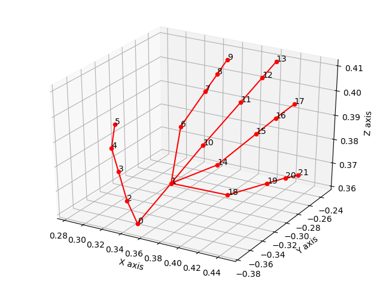
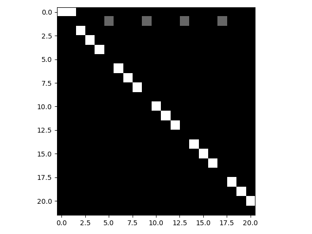
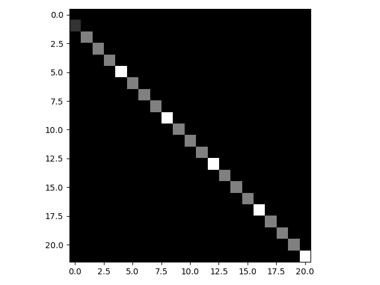

# README

Created: October 9, 2021 3:41 PM

# hand_gesture_recognition_by_DGNN

This is an implementation of hand gesture recognition using DGNN model. DGNN is proposed by the paper "Skeleton-Based Action Recognition with Directed Graph Neural Networks" in CVPR 2019. The code is based on the unofficial Pytorch implementation of DGNN: DGNN-PyTorch

## **Dependencies**

- Python >= 3.5
- scipy >= 1.3.0
- numpy >= 1.16.4
- PyTorch >= 1.1.0

## **Directory Structure**

- generate_data: how raw datasets are processed, split into training and validating sets and saved into .npy files
- graph: the definition of directed hand graph
- models: the definition of DGNN model structure
- feeders/feeder.py: how datasets are read in
- utils/trainer.py: code for the training and validating processes
- main.py: set up training

## **Downloading & Generating Data**

### **DHG-14/28 dataset**

1. The DHG14/28 dataset can be downloaded from [here](http://www-rech.telecom-lille.fr/DHGdataset/)

2. After downloading, unzip it and put the folder `DHG2016` to the base folder
   
    The structure of folder DHG2016 should be like:
    
    ```
    +---gesture_1
    |   +---finger_1
    |  |   +---subject_1
    |  |  |   +---essai_1
    |  |  |   |
    |  |  |   |   depth_1.png
    |  |  |   |   depth_2.png
    |  |  |   |   ...
    |  |  |   |   depth_N.png
    |  |  |   |   general_information.txt
    |  |  |   |   skeleton_image.txt
    |  |  |   |   skeleton_world.txt
    |  |  |   |
    |  |  |   \---essai_2
    |  |  |   ...
    |  |  |   \---essai_5
    |  |   \---subject_2
    |  |   ...
    |  |   \---subject_20
    |   \---finger_2
    ...
    \---gesture_14
    informations_troncage_sequences.txt
    ```
    
3. Then in `generate_data`, run `generate_joint_data.py` as follows to generate joint data:
   
    ```bash
    python3 generate_joint_data.py --troncage_file "./DHG2016/informations_troncage_sequences.txt"
    ```
    
    After that, the traning and validating joint data files, and their corresponding label files in npy format can be found in the `data` folder.
    
4. Then in `generate_data`, run `generate_bone_data.py` as follows to generate joint data:
   
    ```bash
    python3 generate_bone_data.py
    ```
    
     After that, the traning and validating joint data files in npy format can be found in the `data` folder.

5. Run `generate_rotation_data.py` and `generate_rotation_motion_data.py` to produce rotation information to replace bone information in directed graphs.

   

## Definition of directed graph for hand skeleton

According to the paper, we defined the directed graph for the hand skeleton of DHG14/28 dataset as follows:



- joint number: 22
- bone number: 21
  
    ```bash
    directed_edges = [(i, j) for i, j in [
        (0,1),(0,2),(2,3),(3,4),(4,5),
        (1,6),(6,7),(7,8),(8,9),
        (1,10),(10,11),(11,12),(12,13),
        (1,14),(14,15),(15,16),(16,17),
        (1,18),(18,19),(19,20),(20,21),(0,0) # (0,0) is to keep the tensor size same as the joint tensor
    ]] 
    ```
    

The original source and target matrices are visualized as follows:





## Training

```bash
python3 main.py --mode 'train'
```

Use `—help` to know about arguments you can play with.

## Validating

To test some model weights (by default saved in ./checkpoints/), do:

```bash
python3 main.py --mode 'validate' --resume "./checkpoints/model.pth"
```

If to train and validate the two-stream model, run the function `train_TwoStreamDGNN` under `if __name__ == '__main__':`

```python
train_TwoStreamDGNN(args)
```

## TODO

- Add two-steam DGNN model √

