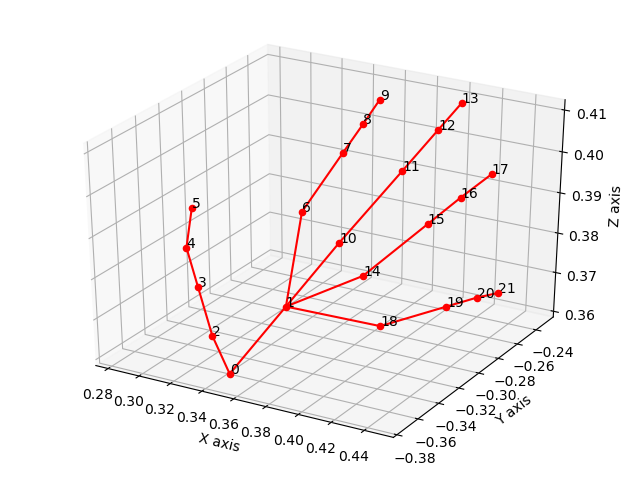
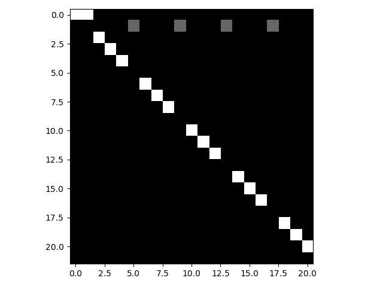
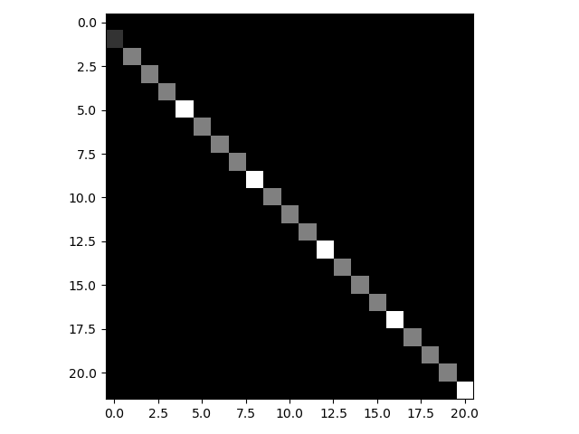

# Hand Gesture Recognition by DGNN

> A PyTorch implementation of hand gesture recognition using Directed Graph Neural Networks (DGNN).
> Original paper of DGNN: [Skeleton-Based Action Recognition with Directed Graph Neural Networks](https://arxiv.org/abs/1901.08664) (CVPR 2019)

## Overview

This project implements the DGNN model for hand gesture recognition on the **DHG-14/28** dataset. The model processes skeleton data (22 hand joints) represented as a directed graph, learning both node features (joint positions) and edge features (bone vectors) through alternating graph convolution and temporal convolution layers.

**Key Features:**
- Directed graph construction for hand skeleton with 22 joints and 21 bones
- Dual-branch architecture processing joint data and bone data simultaneously
- Learnable graph topology (adaptive adjacency matrices)
- Graph freezing strategy for stable training in early epochs

## Model Architecture

```
Input: (N, 3, T, V_joint) for joint data, (N, 3, T, V_bone) for bone data
  │
  ├─ Data Batch Normalization
  │
  ├─ DGN Block 1: GraphConv → TemporalConv (3 → 32 channels)
  ├─ DGN Block 2: GraphConv → TemporalConv (32 → 64 channels)
  ├─ DGN Block 3: GraphConv → TemporalConv (64 → 64 channels)
  │
  ├─ Global Average Pooling over time & nodes
  │
  ├─ Concatenate joint features + bone features
  │
  └─ Fully Connected → Output (14 classes)
```

### DGN Block Structure
Each DGN Block contains:
1. **Graph Aggregation**: Aggregates features from source/target nodes using learnable incidence matrices
2. **Feature Update**: Updates node/edge features using aggregated information
3. **Temporal Convolution**: 1D convolution along the time dimension

## **Dependencies**

- Python >= 3.5
- scipy >= 1.3.0
- numpy >= 1.16.4
- PyTorch >= 1.1.0
- hiddenlayer (for training visualization)
- tqdm (for progress bars)
- scikit-learn (for evaluation metrics)
- matplotlib (for graph visualization)

## **Directory Structure**

```
hand_gesture_recognition_by_DGNN/
├── generate_data/              # Data preprocessing scripts
│   ├── generate_joint_data.py  # Generate joint position data
│   └── generate_bone_data.py   # Generate bone vector data
├── graph/
│   └── directed_graph.py       # Directed hand graph definition
├── models/
│   └── dgnn.py                  # DGNN model architecture
├── feeders/
│   └── feeder.py                # Dataset loader (joint + bone)
├── utils/
│   ├── trainer.py               # Training & validation logic
│   └── mylogger.py              # Logging utilities
├── imgs/                        # Documentation images
├── data/                        # Generated data files (after preprocessing)
├── checkpoints/                 # Model checkpoints (saved during training)
├── main.py                      # Training & validation entry point
└── README.md
```

## **Dataset Format**

### DHG-14/28 Dataset
- **22 hand joints** with 3D coordinates (x, y, z)
- **21 bones** representing connections between joints
- **14 gesture classes** (gestures 1-7: fine-grained, gestures 8-14: coarse)
- **2 finger states** (finger 1: using one finger, finger 2: using two fingers)
- **20 subjects**, **5 trials per subject**

### Generated Data Files
After preprocessing, the following files are generated in `data/`:
| File | Shape | Description |
|------|-------|-------------|
| `train_joint_data.npy` | (N_train, 3, 25, 22, 1) | Training joint positions |
| `train_bone_data.npy` | (N_train, 3, 25, 21, 1) | Training bone vectors |
| `train_label.npy` | (N_train, 1) | Training labels |
| `test_joint_data.npy` | (N_test, 3, 25, 22, 1) | Test joint positions |
| `test_bone_data.npy` | (N_test, 3, 25, 21, 1) | Test bone vectors |
| `test_label.npy` | (N_test, 1) | Test labels |

**Data format:** `(N, C, T, V, M)` where:
- `N`: Number of samples
- `C`: Number of channels (3 for x, y, z coordinates)
- `T`: Number of frames (25 after downsampling)
- `V`: Number of vertices (22 for joints, 21 for bones)
- `M`: Number of persons (1)

## **Downloading & Generating Data**

### **DHG-14/28 dataset**

1. The DHG14/28 dataset can be downloaded from [here](http://www-rech.telecom-lille.fr/DHGdataset/)

2. After downloading, unzip it and put the folder `DHG2016` to the base folder
   
    The structure of folder DHG2016 should be like:
    
    ```
    +---gesture_1
    |   +---finger_1
    |  |   +---subject_1
    |  |  |   +---essai_1
    |  |  |   |
    |  |  |   |   depth_1.png
    |  |  |   |   depth_2.png
    |  |  |   |   ...
    |  |  |   |   depth_N.png
    |  |  |   |   general_information.txt
    |  |  |   |   skeleton_image.txt
    |  |  |   |   skeleton_world.txt
    |  |  |   |
    |  |  |   \---essai_2
    |  |  |   ...
    |  |  |   \---essai_5
    |  |   \---subject_2
    |  |   ...
    |  |   \---subject_20
    |   \---finger_2
    ...
    \---gesture_14
    informations_troncage_sequences.txt
    ```
    
3. Then in `generate_data`, run `generate_joint_data.py` as follows to generate joint data:
   
    ```bash
    python3 generate_joint_data.py --troncage_file "./DHG2016/informations_troncage_sequences.txt"
    ```
    
    After that, the training and validating joint data files, and their corresponding label files in npy format can be found in the `data` folder.
    
4. Then in `generate_data`, run `generate_bone_data.py` as follows to generate bone data:

    ```bash
    python3 generate_bone_data.py
    ```

    This computes bone vectors as the difference between connected joint positions. The resulting bone data files will also be saved in the `data` folder.
    

## Definition of directed graph for hand skeleton

According to the paper, we defined the directed graph for the hand skeleton of DHG14/28 dataset as follows:



- joint number: 22
- bone number: 21
  
    ```bash
    directed_edges = [(i, j) for i, j in [
        (0,1),(0,2),(2,3),(3,4),(4,5),
        (1,6),(6,7),(7,8),(8,9),
        (1,10),(10,11),(11,12),(12,13),
        (1,14),(14,15),(15,16),(16,17),
        (1,18),(18,19),(19,20),(20,21),(0,0) # (0,0) is to keep the tensor size same as the joint tensor
    ]] 
    ```
    

The original source and target matrices are visualized as follows:





## Training

```bash
python3 main.py --mode 'train'
```

### Training Arguments

| Argument | Default | Description |
|----------|---------|-------------|
| `--mode` | `train` | Mode: 'train' or 'validate' |
| `--base_lr` | `0.001` | Initial learning rate |
| `--optimizer` | `Adam` | Optimizer: 'Adam' or 'SGD' |
| `--weight_decay` | `5e-5` | Weight decay (L2 regularization) |
| `--step` | `[30, 60, 90]` | Milestones for learning rate decay (epoch) |
| `--end_epoch` | `150` | Total training epochs |
| `--freeze_graph_until` | `20` | Freeze graph parameters until this epoch |
| `--train_batch_size` | `32` | Training batch size |
| `--save_interval` | `20` | Save checkpoint every N epochs |
| `--checkpoint_dir` | `./checkpoints/` | Directory to save checkpoints |

### Default Data Paths
| Argument | Default Path |
|----------|-------------|
| `--train_joint_file` | `../data/train_joint_data.npy` |
| `--train_bone_file` | `../data/train_bone_data.npy` |
| `--train_label_file` | `../data/train_label.npy` |
| `--test_joint_file` | `../data/test_joint_data.npy` |
| `--test_bone_file` | `../data/test_bone_data.npy` |
| `--test_label_file` | `../data/test_label.npy` |

### Training Output
During training, the following files are saved to `checkpoint_dir/`:
- `checkpoint_ep{N}.pth` - Model checkpoint at epoch N
- `model_best.pth` - Best model based on validation loss
- `train.log` - Training log file
- `training_process_loss.png` - Loss curve
- `training_process_metrics.png` - Accuracy/Precision/Recall/F1 curves

## Validating / Testing

To evaluate a trained model on the test set:

```bash
python3 main.py --mode 'validate' --resume "./checkpoints/model_best.pth"
```

The validation will output:
- `test_accuracy` - Classification accuracy
- `test_precision` - Macro-averaged precision
- `test_recall` - Macro-averaged recall
- `test_f1_score` - Macro-averaged F1 score

## Hand Skeleton Graph Definition

The hand skeleton is represented as a directed graph with **22 joints** and **21 bones**:


**Joint connections (directed edges):**
```python
directed_edges = [
    # Thumb
    (0,1), (0,2), (2,3), (3,4), (4,5),
    # Index
    (1,6), (6,7), (7,8), (8,9),
    # Middle
    (1,10), (10,11), (11,12), (12,13),
    # Ring
    (1,14), (14,15), (15,16), (16,17),
    # Pinky
    (1,18), (18,19), (19,20), (20,21),
    # Dummy edge for tensor shape alignment
    (0,0)
]
```

The source and target incidence matrices are visualized as follows:


## Citation

If you use this code in your research, please cite the original DGNN paper:

```bibtex
@inproceedings{geng2018directed,
  title={Skeleton-Based Action Recognition with Directed Graph Neural Networks},
  author={Geng, Libo and Dong, Jinxi and Liu, Jieming},
  booktitle={Proceedings of the IEEE Conference on Computer Vision and Pattern Recognition (CVPR)},
  pages={7912--7921},
  year={2019}
}
```
